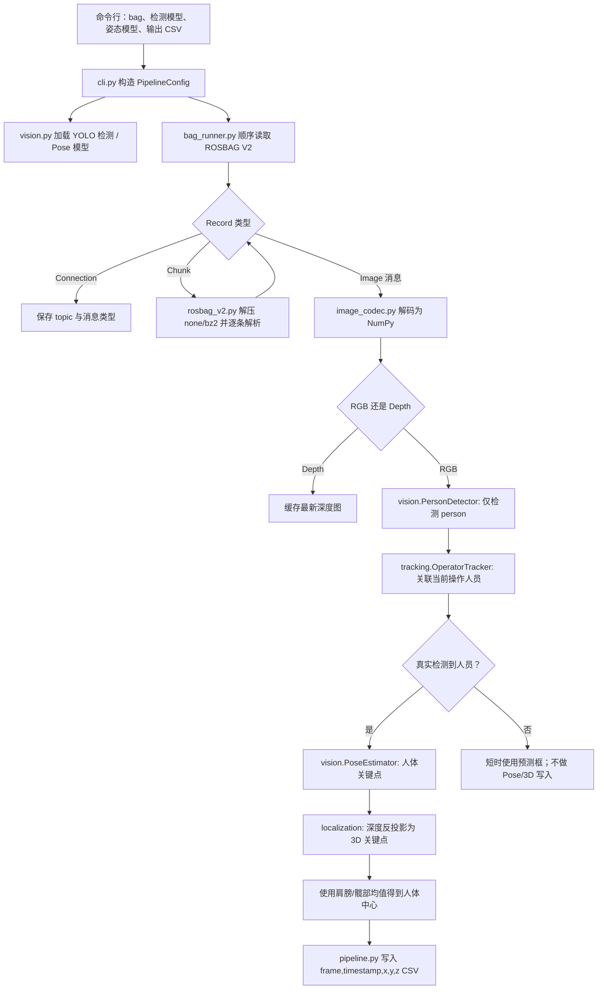

# RGB-D 操作人员三维定位（重构版）

本目录将原 `bag_yolo_python_final_v5.py` 的职责拆分为独立模块：ROS bag 读取、图像解码、视觉模型适配、人员跟踪、三维定位和流程编排。模型和 bag 文件均不纳入仓库。

## 目录

```text
refactored_bag_pipeline/
├── src/rgbd_operator_pipeline/
│   ├── rosbag_v2.py       # ROSBAG V2 record/chunk 解析与 bz2 解压
│   ├── image_codec.py     # sensor_msgs/Image → NumPy
│   ├── bag_runner.py      # 将 bag 消息分派给流水线
│   ├── vision.py          # YOLO 人体检测与 YOLO Pose 适配器
│   ├── tracking.py        # 单操作人员关联与短时运动预测
│   ├── localization.py    # 深度反投影、躯干中心计算
│   ├── pipeline.py        # 可测试的业务编排和 CSV 输出
│   ├── config.py          # 路径与相机内参配置
│   └── cli.py             # 命令行入口
├── tests/test_smoke.py    # 不加载 YOLO/GPU 的 smoke test
├── requirements.txt
└── .gitignore
```

## 运行流程



数据约束：深度图必须与 RGB 关键点使用同一像素坐标系；当前内参和 `depth_scale=0.001` 来自原脚本。若相机未对齐，应先按 `depth_fusion.py` 的外参完成对齐。

## 安装与运行

在本目录下创建虚拟环境并安装依赖：

```powershell
python -m venv .venv
.\.venv\Scripts\Activate.ps1
pip install -e .
rgbd-operator <capture.bag> --detector ..\models\yolo26n.pt --pose ..\models\yolo26n-pose.pt --output outputs\operator_3d_position.csv
```

运行时默认以原始 RGB 分辨率显示实时可视化窗口：灰色框为全部人员检测，绿色/橙色框为当前操作人员（真实检测/短时预测），并绘制躯干关键点和有效的三维中心。按 `q` 或 `Esc` 可提前结束处理。无图形界面的批处理可加 `--no-display`；如需缩放，可用 `--display-scale 0.5`。

## Smoke test

该测试使用假检测器和假姿态模型，验证 RGB-D 数据能产生一条三维 CSV 轨迹，不需要 bag、GPU 或 YOLO 权重：

```powershell
python -m unittest discover -s tests -v
```

## Git

初始化后建议执行：

```powershell
git add .
git commit -m "refactor: modular RGB-D operator pipeline"
```
